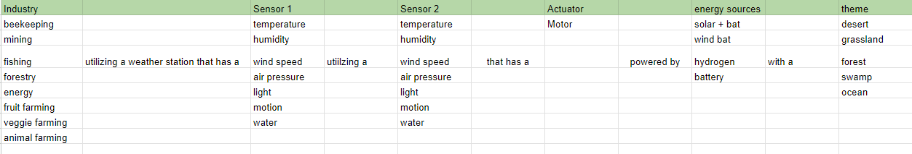
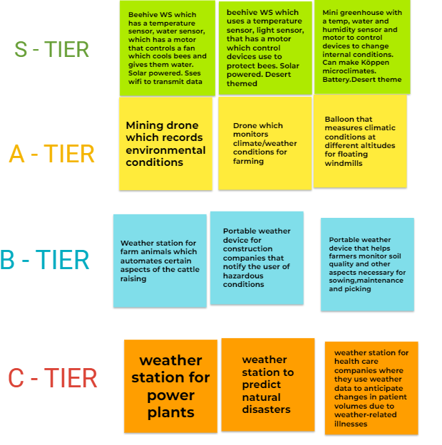
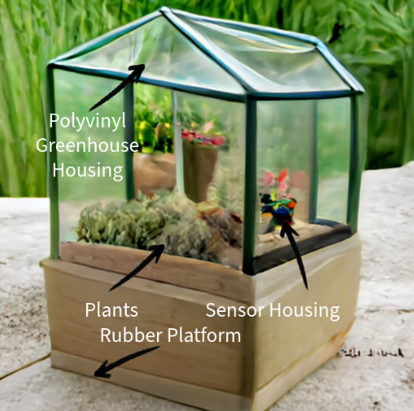
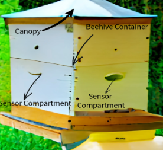

# Design Ideation

Our team approached the start of the design ideation process by individually brainstorming ideas. There was no limit or personal requirements. We just needed to create as many ideas as possible. We came up with roughly 20  ideas but we began to run into obstacles as we continued to do more and eventually plateaued around 25. We then decided we needed to do something more systematic. Our team then created the Morphological Chart

By listing all the possible requirements, industry applications and aesthetic elements in separate columns we were able to pick paths that consisted of one element per column without duplicates. And at the end of the table we had a possible idea for a product. This ballooned our possible options from 25 to 6720. It became a lot easier after creating different products. With more to work with, we used a simple tier list to rank ideas according to our defined user needs and requirements, with S being a serious choice for the main project, going down to C which were projects that could be good but difficult to fit with our current time schedule
***
 

After ranking, we chose our S tier options and utilized AI generated images to get an initial concept 
***

Concept one introduces a portable weather device designed as an attachment to be placed near a corner of a beehive. This device features a large shade structure mounted on top, incorporating solar panels that power the entire system. The shade not only provides protection for the beehive but also serves as a platform for essential sensors and components.

The device is equipped with a temperature sensor that continuously monitors the internal environment of the beehive. When the temperature reaches a predefined threshold, a set of fans is activated to assist the bees in cooling down, ensuring optimal conditions for the colony. Additionally, a water sensor is integrated to monitor water levels within the hive.

In response to low water levels, the device includes a water dispenser powered by a motor. This dispenser ensures that the bee colony stays hydrated by autonomously providing water when needed, relieving hive owners from manual intervention.

One noteworthy feature is the capability to transmit all collected sensor data to an external device via the internet. This enables beekeepers to remotely monitor hive conditions in real-time, providing insights into the well-being of the colony. Moreover, users have the flexibility to manually activate the fans when needed, offering a hands-on approach to hive management.
***

Concept two introduces an innovative mini greenhouse equipped with a micro-weather station designed to record and control key environmental factors, including temperature, humidity, and water levels. This sophisticated system allows users to customize and regulate the internal climate based on specific preferences. Remarkably, users can manipulate the Köppen climate classification inside the greenhouse, tailoring it to their desired conditions. The integration of such flexibility enables the cultivation of a diverse range of plants that thrive in different climates.

Moreover, the recorded data from the micro-weather station can be seamlessly transmitted via WiFi to external devices. This not only provides real-time monitoring of the greenhouse conditions but also allows users to make informed decisions remotely. The concept not only showcases advancements in precision agriculture but also demonstrates a commitment to sustainable and efficient greenhouse management practices.
***

Our final concept integrates advanced features to optimize hive conditions and enhance the well-being of the colony. A temperature monitoring device is incorporated, activating a cooling fan when internal temperatures rise and retracting a canopy when temperatures drop below a certain threshold. This ensures a comfortable environment for the bees in varying weather conditions. Additionally, a light sensor is employed to detect the start of the day, initiating the deployment of the canopy, which retracts at sunset. During the day, a strategically placed hole allows the bees to exit and enter the hive. All sensory information gathered within the hive is transmitted seamlessly via WiFi to external devices, allowing beekeepers to remotely monitor hive conditions in real-time. This forward-thinking technology not only contributes to efficient hive management but also showcases a commitment to sustainable beekeeping practices.
