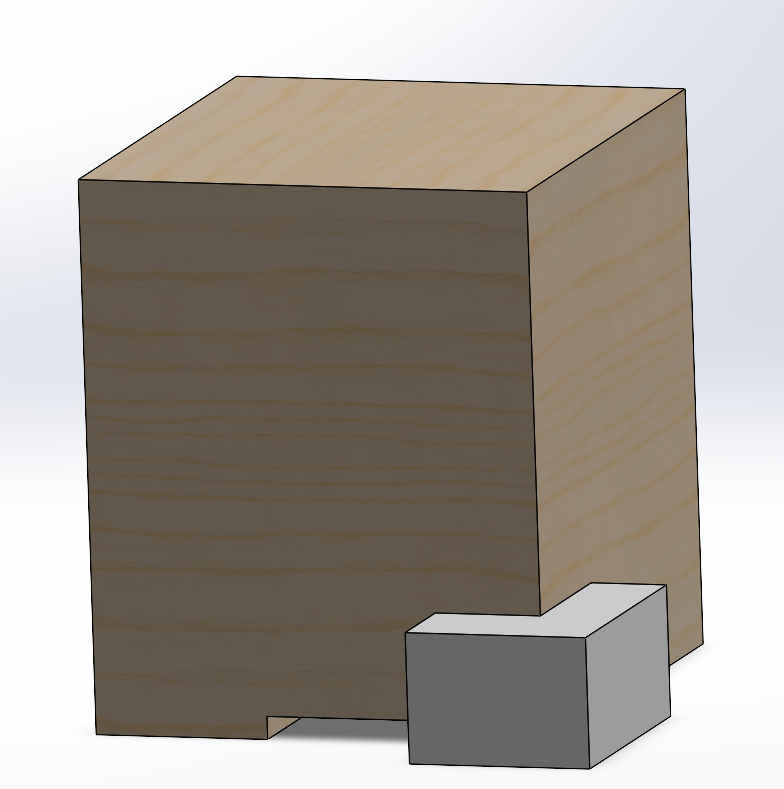
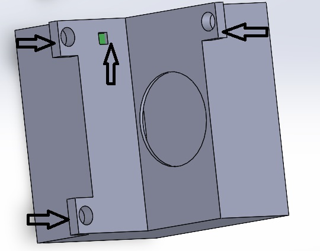

# Our Design: The BEECooler
Our project is a cooling attachment that goes on the side of a Langstroth hive. These hives are the standard hives in usage in the USA and Canada

**Figure 11: Bee Box"**

above is the location of where the device would be located. Next to the bee space, a special location where bees will not attempt to fill in holes. Ensuring that all the openings of the Hive are within beespace limits is essential for the continued function of the device.The value for this is approxiamately 0.6-1cm. 

**Figure 12: Exploded View"**

here is an exploded version of our device. With all key components labelled. But there is quite a big gap for the fan to blow airout. This not only would be a chopping danger for bees, but ultimately would get filled up by propolis or bees wax. To solve this, our team proposed to enclose the gaps with a pocket mesh, with holes within the beespace limits. 

**"Figure 13: Net"**

Lastly, or devices is fastened to the hive using woodscrews in the given spaces located here in the backview. The internal temperature sensening device can be seen indicated by the arrow pointing at the green space. 

**"Figure 14: Selected Design"**
